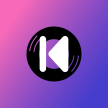

This tutorial goes through steps to add new icons to Kreate.

Most of the steps are convered in [Custom assets](./custom-assets).
It is highly recommended that you read through this before this.

:::info
Both SVG and PSD are accepted by Android Studio. However, SVGs are more
preferable, and it's the only thing demonstrated in this tutorial
:::

:::tip
Use SVG editor like [Inkscape](https://inkscape.org/) to modify your vector image
:::

## 📋 Prerequisite

1. Icon design
2. Icon's specs meet Android's [adaptive icon](https://developer.android.com/develop/ui/views/launch/icon_design_adaptive) standards

Here's con takeaway keys:

- Your icon's viewport must be 108 x 108
- The actual icon (icon without background) must be at most 72 x 72

In this tutorial, Kreate's icon is used as the demo

<details>
  <summary>Demo SVG</summary>
  
  

  ```svg
  <svg
    width="108"
    height="108"
    viewBox="0 0 108 108"
    version="1.1"
    id="svg1"
    xml:space="preserve"
    xmlns:xlink="http://www.w3.org/1999/xlink"
    xmlns="http://www.w3.org/2000/svg"
    xmlns:svg="http://www.w3.org/2000/svg"><defs
      id="defs1"><linearGradient
        id="linearGradient12"><stop
          style="stop-color:#f86ab9;stop-opacity:1;"
          offset="0"
          id="stop12" /><stop
          style="stop-color:#190dc0;stop-opacity:0.80000001;"
          offset="1"
          id="stop13" /></linearGradient><linearGradient
        xlink:href="#linearGradient12"
        id="linearGradient2"
        gradientUnits="userSpaceOnUse"
        x1="43.763935"
        y1="107.3907"
        x2="468.23608"
        y2="404.60928" /></defs><g
      id="layer1"
      transform="matrix(0.20841985,0,0,0.20841985,0.64451695,0.64451695)"><rect
        style="display:inline;opacity:1;fill:url(#linearGradient2);stroke:none;stroke-width:32.3866;stroke-opacity:1"
        id="rect12"
        width="518.18481"
        height="518.18481"
        x="-3.0923972"
        y="-3.0923972" /></g><g
      id="layer1-5"
      transform="matrix(1.2952953,0,0,1.2952953,-15.945946,-15.945946)"><g
        id="g26"
        style="display:inline;fill:none;stroke-linecap:square;stroke-miterlimit:10"
        transform="matrix(0.8165646,0,0,0.8165646,9.9055119,9.9055119)"><path
          id="path26"
          style="fill:#000000;fill-opacity:1;fill-rule:evenodd;stroke:none;stroke-width:0.978898;stroke-linecap:round;stroke-linejoin:round;stroke-dasharray:none;stroke-opacity:1"
          d="M 54,27.999999 A 26,26 0 0 0 27.999999,54 26,26 0 0 0 54,80 26,26 0 0 0 80,54 26,26 0 0 0 54,27.999999 Z m -16.18537,8.528173 0.672467,0.704782 a 23.237598,23.237598 0 0 0 -6.969342,14.063329 l -0.96946,-0.103101 a 24.207107,24.207107 0 0 1 7.266335,-14.66501 z m 2.448272,3.306937 0.704782,0.714015 A 18.57375,18.57375 0 0 0 35.569483,52.030303 L 34.57848,51.937973 A 19.594285,19.594285 0 0 1 40.262902,39.835109 Z M 54,39.999763 A 14,14 0 0 1 68.000237,54 14,14 0 0 1 54,68.000237 14,14 0 0 1 39.999763,54 14,14 0 0 1 54,39.999763 Z m 18.390507,15.408262 0.826349,0.06155 a 19.594285,19.594285 0 0 1 -5.358191,12.052084 l -0.601681,-0.570904 a 18.757446,18.757446 0 0 0 5.133523,-11.542733 z m 4.1933,0.163116 0.96946,0.05078 A 24.186696,24.186696 0 0 1 70.828599,70.817827 L 70.134588,70.14536 a 23.217187,23.217187 0 0 0 6.449219,-14.574219 z" /></g><g
        style="display:inline;fill:none;stroke-linecap:square;stroke-miterlimit:10"
        id="g12"
        transform="matrix(0.83333333,0,0,0.83333333,9.1143731,9.0795961)"><path
          fill="#ffffff"
          d="m 43.55,37.2 c 1.89,-0.05 3.25,1.86 3.01,3.64 -0.01,8.96 0.02,17.91 -0.02,26.87 -0.09,2.08 -2.62,3.55 -4.43,2.43 -1.4,-0.72 -1.68,-2.36 -1.57,-3.78 0.01,-8.78 -0.02,-17.57 0.02,-26.35 0.12,-1.51 1.45,-2.84 2.99,-2.81 z"
          fill-rule="evenodd"
          id="path7"
          style="display:inline;fill:#ffffff;fill-opacity:1;stroke-width:1.18299;stroke-linecap:square;stroke-miterlimit:10;stroke-dasharray:none" /><path
          id="path9"
          style="display:inline;fill:#ffffff;fill-opacity:1;stroke-width:1.18417;stroke-linecap:square;stroke-miterlimit:10"
          d="m 64.05,37.16 c -1.78,0.03 -2.67,1.72 -3.81,2.82 -3.63,3.97 -7.28,7.93 -10.9,11.92 -1.13,1.37 -0.79,3.48 0.53,4.6 4.07,4.45 8.13,8.92 12.22,13.36 1.5,1.5 4.36,0.76 4.93,-1.29 0.33,-1.39 0.11,-2.85 0.17,-4.27 0,-8.13 0.01,-16.27 -0.01,-24.4 -0.16,-1.53 -1.57,-2.82 -3.13,-2.74 z" /></g></g></svg>
  ```
</details>

This SVG satisfies 2 conditions:

- Viewport is 108 x 108
- Foreground (disc) is 55 x 55

> But why 55 x 55?

The foreground is intended smaller so that when the icon is in different shapes,
part of the gradient background is still available.


## 🔡 Icon types

There are 2 main types of an icon: **Square** and **Round**

## 🏷️ Naming scheme

For app's icons, naming them either `ic_laucher` or `ic_launcher_round`
depends on the [type](#-icon-types) with extension

## 🧩 Icon parts

Since **Android 8.0 (Oreo)**, vector image (XML) can be used to render app's icon.
Vector images provide better scalability, and sometimes, offer better storage.

### Pre Android 8.0

In these versions, rasiterized images are used to render icons

> How are we going to solve the image scalability issue?

By using different images for each **D**ots **P**er **I**nch (DPI), of course.
You can read [Provide alternative bitmaps](https://developer.android.com/training/multiscreen/screendensities#TaskProvideAltBmp) to understand more.

TL;DR, when screen's DPI reaches a certain threshold, new icons set will be used.

Currently, Kreate supports 5 presets: `mdpi`, `hdpi`, `xhdpi`, `xxdpi`, and `xxxdpi`

You can find folder to each preset at:

```
composeApp/src/res/mipmap-<dpi>
```

| dpi | size |
| --- | ---- |
| mdpi | 48 x 48 |
| hdpi | 72 x 72 |
| xhdpi | 96 x 96 |
| xxhdpi | 144 x 144 |
| xxxdpi | 192 x 192 |

> At this point, I don't have to tell you that you need to export your icon design 
> as PNGs and to these locations, right?

:::tip
Use [Inkscape](https://inkscape.org/), this software allows you to
export a single svg file into multiple PNG files with different 
sizes without you having to manually scaling it first.
:::

### Background

:::info
For Android 8.0+
:::

As we move toward [Adaptive Icons](https://developer.android.com/develop/ui/views/launch/icon_design_adaptive), 
things get more complicated.

Background contains unimportant part of the icon, so that's the gradient background of the demo.

For this, you need to export **ONLY** the background of the icon in SVG format and add it to Kreate using
Android Studio, which is shown in [Custom assets](./custom-assets)

Name it `ic_launcher_background.xml` because... standard, duh!

Put it to this folder:

```
composeApp/src/androidMain/res/drawable/
```

### Foreground

:::info
For Android 8.0+

Part of [Adaptive Icon](https://developer.android.com/develop/ui/views/launch/icon_design_adaptive)
:::

This is where what we want user to see, the app's logo.

Similar to [background](#background), you need to export **ONLY** the foreground and import
it to Kreate project using Android Studio as shown in [Custom assets](./custom-assets)

Name it `ic_launcher_foreground.xml`

Put it to this folder:

```
composeApp/src/androidMain/res/drawable/
```

### Monochrome

:::info
For Android 13+
:::

Monochrome icon (or user theme) is fairly new. Basically, the idea is to let user define
the color palette of their OS.


This means that our icons with colors won't work well in this mode. So we have to make
a separate icon for this particular theme mode.

Luckily, Android already has support for it. All we have to do is to export a
version of the icon that is in a single color (you know, monochrome).

Here's an example:

<details>
  <summary>Demo SVG</summary>

  As you can see, the icon has nothing but a simple logo.
  
  

  ```xml
  <svg
    width="71.999992"
    height="72"
    viewBox="0 0 71.999992 72"
    version="1.1"
    id="svg1"
    xml:space="preserve"
    xmlns="http://www.w3.org/2000/svg"
    xmlns:svg="http://www.w3.org/2000/svg"><defs
      id="defs1" /><g
      id="layer1"
      transform="matrix(1.0794128,0,0,1.0794128,-22.288298,-22.288292)"><g
        style="display:inline;fill:none;stroke-linecap:square;stroke-miterlimit:10"
        id="g12"
        transform="translate(0.13724767,0.09551535)"><path
          fill="#ffffff"
          d="m 43.55,37.2 c 1.89,-0.05 3.25,1.86 3.01,3.64 -0.01,8.96 0.02,17.91 -0.02,26.87 -0.09,2.08 -2.62,3.55 -4.43,2.43 -1.4,-0.72 -1.68,-2.36 -1.57,-3.78 0.01,-8.78 -0.02,-17.57 0.02,-26.35 0.12,-1.51 1.45,-2.84 2.99,-2.81 z"
          fill-rule="evenodd"
          id="path7"
          style="display:inline;fill:#ffffff;fill-opacity:1;stroke-width:1.18299;stroke-linecap:square;stroke-miterlimit:10;stroke-dasharray:none" /><path
          id="path9"
          style="display:inline;fill:#ffffff;fill-opacity:1;stroke-width:1.18417;stroke-linecap:square;stroke-miterlimit:10"
          d="m 64.05,37.16 c -1.78,0.03 -2.67,1.72 -3.81,2.82 -3.63,3.97 -7.28,7.93 -10.9,11.92 -1.13,1.37 -0.79,3.48 0.53,4.6 4.07,4.45 8.13,8.92 12.22,13.36 1.5,1.5 4.36,0.76 4.93,-1.29 0.33,-1.39 0.11,-2.85 0.17,-4.27 0,-8.13 0.01,-16.27 -0.01,-24.4 -0.16,-1.53 -1.57,-2.82 -3.13,-2.74 z" /></g></g></svg>
  ```
</details>

Export it to SVG file and import under name `ic_launcher_monochrome.xml`

Put it to this folder:

```
composeApp/src/androidMain/res/drawable/
```

### Adaptive icon

This is the final step to combine all parts together (except for the [Pre Android 8.0](#pre-android-80)).

Both `ic_launcher.xml` and `ic_launcher_round.xml` are located inside `composeApp/src/androidMain/res/mipmap-anydpi-v26`

With:

1. **anydpi**: can be drawn on any screen
2. **v26**: API 26+ (Android 8.0+) is required

<details>
  <summary>ic_launcher.xml</summary>
  
  ```xml
  <adaptive-icon xmlns:android="http://schemas.android.com/apk/res/android">
      <background android:drawable="@drawable/ic_launcher_background"/>
      <foreground android:drawable="@drawable/ic_launcher_foreground"/>
      <monochrome android:drawable="@drawable/ic_launcher_monochrome"/>
  </adaptive-icon>
  ```
</details>

<details>
  <summary>ic_launcher_round.xml</summary>
  
  ```xml
  <adaptive-icon xmlns:android="http://schemas.android.com/apk/res/android">
    <background android:drawable="@drawable/ic_launcher_background"/>
    <foreground android:drawable="@drawable/ic_launcher_foreground"/>
    <monochrome android:drawable="@drawable/ic_launcher_monochrome"/>
  </adaptive-icon>
  ```
</details>

:::warning
These files are generally not required update every time icons are updated
because they contain references to different parts. Updating those parts
is enough.
:::

## Miscellanous icons

Kreate uses more than what descibed above, especially the monochrome version.

### Inverted monochrome

This file is used in area such as notification, and player. 
We can use [ic_launcher_monochrome.xml](#monochrome) but the vectos is too
small for the job.

<details>
  <summary>app_icon_monochrome.xml</summary>

  
  
  ```xml
  <svg
    width="24"
    height="24"
    viewBox="0 0 24 24"
    version="1.1"
    id="svg1"
    xml:space="preserve"
    xmlns="http://www.w3.org/2000/svg"
    xmlns:svg="http://www.w3.org/2000/svg"><defs
      id="defs1" /><path
      id="path28"
      style="fill:#ffffff;fill-opacity:1;fill-rule:evenodd;stroke:none;stroke-width:0.355963;stroke-linecap:round;stroke-linejoin:round;stroke-dasharray:none;stroke-opacity:1"
      d="M 12,0 A 12,12 0 0 0 0,12 12,12 0 0 0 12,24 12,12 0 0 0 24,12 12,12 0 0 0 12,0 Z m 3.783333,6 C 16.33,5.96333 16.836667,6.436667 16.91,6.983333 c 0,2.946667 0,5.926667 0,8.873334 0,0.51 0.07333,1.053333 -0.07333,1.563333 -0.183333,0.726667 -1.236667,0.98 -1.783333,0.433333 -1.490001,-1.6 -2.943334,-3.236666 -4.436667,-4.836666 -0.47,-0.4 -0.616667,-1.163334 -0.18,-1.67 1.31,-1.456667 2.616666,-2.91 3.963333,-4.33 C 14.8,6.616667 15.126667,6 15.783333,6 Z M 8.33,6 c 0.69,-0.03667 1.163333,0.69 1.09,1.31 0,3.273333 0,6.51 0,9.783333 -0.03667,0.76 -0.946667,1.306667 -1.636667,0.87 C 7.273333,17.71 7.2,17.126667 7.236667,16.616667 c 0,-3.2 -0.03667,-6.4 0,-9.6 C 7.273337,6.473333 7.746667,6 8.326667,6 Z" /></svg>
  ```
</details>

Since this icon isn't under icon's constraints, it's counted as a normal icon.
Meaning, its canvas must be 24 x 24 and content should be as big.

The most common way of drawing inverted icon is to draw a circle as the background,
then create cut-out in the middle with the icon. The cut-out part becomes transparent.

Here's a video going through this feature: https://youtu.be/tdbQXUnLSVw

### Assets

The final place you need to put your designs is `assets/degisn`.

This is where all of your SVGs go. Uploading original works here
will allow people to use them to create variant in the future.

Files that are required:

- ic_launcher_background.svg
- ic_launcher_background_round.svg
- ic_launcher_foreground.svg
- ic_launcher_monochrome.svg
- app_icon_monochrome.xml

:::warning
Please don't add rasterized images (PNGs) to this folder
:::

## 👨🏻‍💻 Commit & open pull request

Don't forget to commit your changes and open a new pull request. Follow [Getting Started - Acknowledge changes](/dev/getting_started#acknowledge-changes)