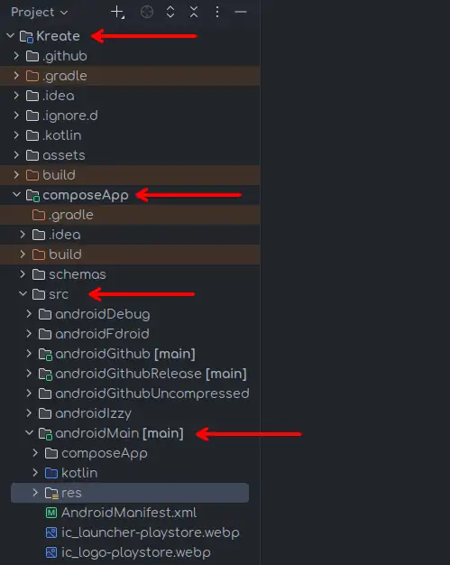
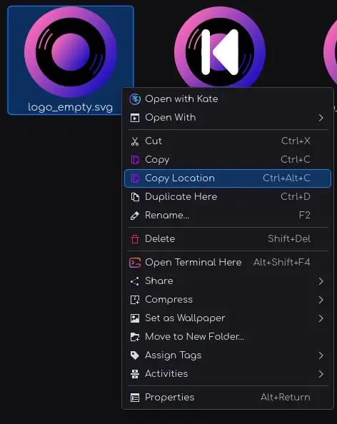
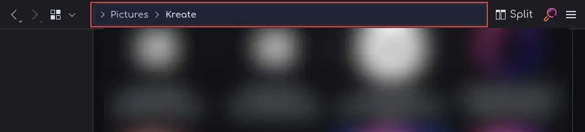
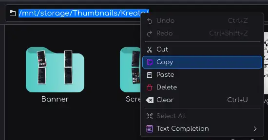
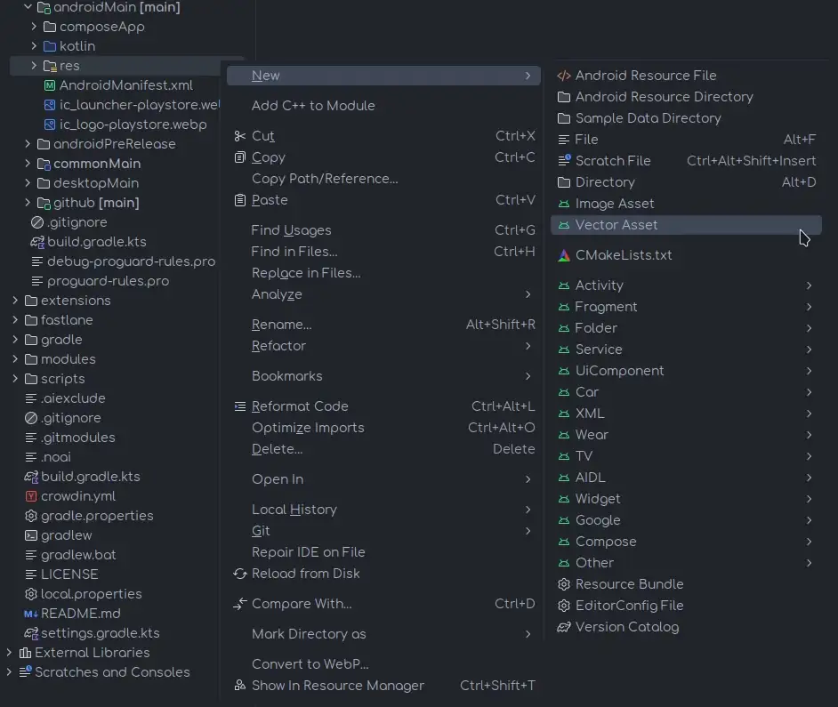
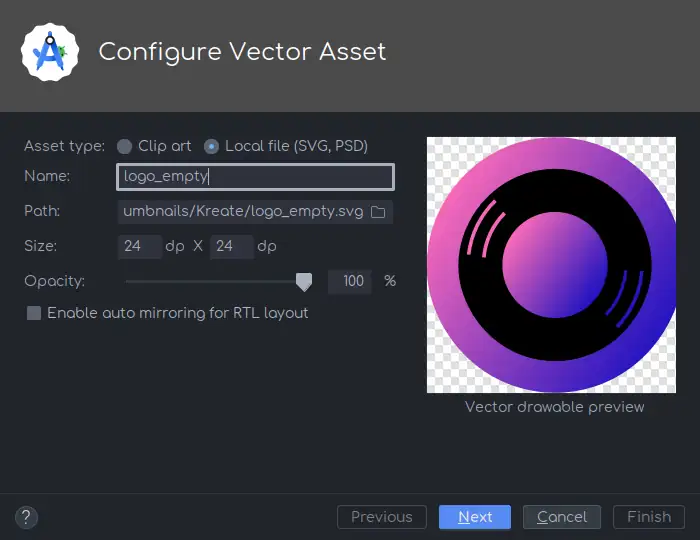
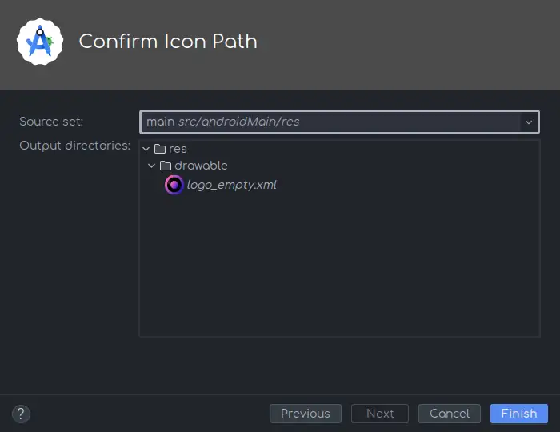

import { IonIcon } from '@ionic/react';
import { logoAndroid } from 'ionicons/icons';

This tutorial will walk you through steps to add your assets to Kreate project.

:::tip
For best results, please consider using [<IonIcon icon={logoAndroid} /> Android Studio](https://developer.android.com/studio).
To setup Kreate in Android Studio, please refer to [Getting Started](/dev/getting_started).
:::

The very first step is to make sure we're working on the correct folder. In this tutorial, we're only
going to use `res` folder in `androidMain`. Here's the path:

```
composeApp/src/androidMain/res
```



:::info
Kreate is categorized as a multiple platform project. Meaning, `res` in `androidMain`,
`commonMain`, `desktopMain` are valid paths.

Each serves different platform, except for `commonMain`, which is universal. 
But for simplicity, this tutorial will not going to use it.
:::

## 📍 Get SVG location

> You must satisfy all requirements in [Prerequisite](#prerequisite) section in order to move on.

There are several ways you can copy a file's path. Some OS has this buton right in the menu.



If you don't see this option, you can use the address bar (typically located at the top of your file manager)



To copy from here, you need to select it, then highlight everything to copy.



:::info
[KDE Plasma](https://kde.org/plasma-desktop/) is used in this tutorial, 
but [File Explorer](https://en.wikipedia.org/wiki/File_Explorer) and [Finder](https://en.wikipedia.org/wiki/Finder_(software))
should have similar approach
:::

## ✎ᝰ Converting SVG to XML

> Why? You may ask. 

The answer is simple, Android doesn't support SVG, at least, not all of the features SVG provides.

XML file (internally called [VectorDrawable](https://developer.android.com/develop/ui/views/graphics/vector-drawable-resources)) 
as the name implied, is in fact, a Vector, but with limited functionalities compared to SVG

Luckily, you don't have to convert your SVG to XML prior to the import, Android Studio does this right before importing SVG file/

To import, follow these steps:

1. Right-click `res`
2. New
3. Vector asset



4. Configure your vector

After clicking **Vector asset**, you'll be greeted by this dialog - Configure vector asset



Here, you'll need to add a few things:

- **Asset type**: what are you importing - `Local file` in this case
- **Name**: name of this asset, and name to be used in the development
  > Name must not contain any spaces, replace them with underscore ( _ )
- **Path**: path to your SVG file
- **Size**: the size of this vector **after** the conversion, should be 24 x 24 in most cases.
- **Opacity**: see-through level
- **Enable auto mirroring for RTL layout**: Check if your vector must be mirrored (flipped horizontally) when RTL is applied (usually for texts, or arrows)

> Read a more detailed article [here](https://developer.android.com/studio/write/vector-asset-studio#importing)

5. Next
6. Verify everything
  > This confirmation dialog lets you make sure everything is in its correct place.
  
  

7. Finish

## 📋 Confirm asset & commit

At this point, you should be able to see your newly added asset in [Resource Manager](https://developer.android.com/studio/write/resource-manager).

The last step is to commit your changes and push it to your fork, and open a pull request. 
There's a tutorial for this too, check out [Getting Started - Acknowledge changes](/dev/getting_started#acknowledge-changes)