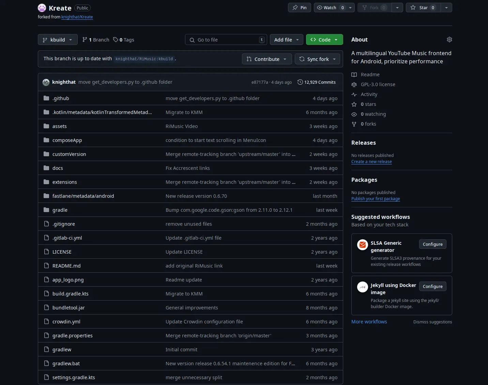
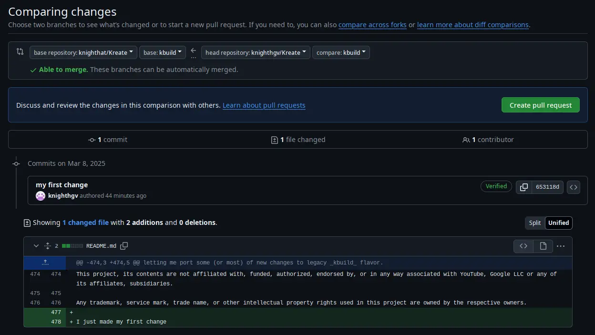

:::info[Requirements]

Before we get into the bits and pieces, you must meet the following requirements.

1.  [Git](https://git-scm.com/downloads) - Version control system
2. A  [Github account](https://github.com/signup) - All you need is an email address
3.  [Android SDK](https://developer.android.com/tools) - Don't download if you're using Android Auto
4. Some kind of IDE - Simple text editor works but it's a pain to use in the long run
5. Internet - DUH!

:::

:::warning[If you have less than **16GB** of RAM]

Is it not ideal to run [Android Studio](https://developer.android.com/studio) when you only have less than **16GB** of RAM.

You can use alternative IDE/text editor such as [VSCodium](https://vscodium.com/) (VSCode with no telemetry), but you will not
have the ability to use [Android emulator](https://developer.android.com/studio/run/managing-avds).
:::

Now that we have that out of the way, let's get really started!

## 📋 Fork the repository

The first step is not to clone the repo, but to fork it. Without forking, you can't make pull request (PR).

:::info[Shortcuts]

Click [HERE](https://github.com/login) to login, and [HERE](https://github.com/signup) to register

:::

After logging in, go to our [remote repository](https://github.com/knighthat/RiMusic)


:::tip[Use SSH to clone repo]

Github allows you to use SSH key pair to clone repo so you don't have
to use secret key every time you want to push from local repo remote repo.

> [CLICK ME](https://docs.github.com/en/authentication/connecting-to-github-with-ssh/generating-a-new-ssh-key-and-adding-it-to-the-ssh-agent) to learn more

:::

There are some basic information you need to fill out.

> Don't worry, you can still modify them later on.


:::note

You should create a separate branch for development to keep the `main` branch in sync with `upstream`.

:::

Now all you have to do is **wait** until the forking process is completed.



## 📥 Clone remote repo to your machine

### Cloning via HTTPS

Github has a well written instruction on this matter, here's the [link](https://docs.github.com/en/repositories/creating-and-managing-repositories/cloning-a-repository).

### Cloning via SSH

> This is an advanced feature. However, it helps reduce the time you need to input your password.

As mentioned before, you can use SSH key pair to clone & push your changes without having to generate a
[Personal Access Token](https://docs.github.com/en/authentication/keeping-your-account-and-data-secure/managing-your-personal-access-tokens#about-personal-access-tokens).

To clone the repo using SSH, open your terminal (or command prompt in Windows) and execute this command:

```shell
git clone --recurse-submodules git@github.com:[username]/[repo_name]
```

**_username_** is what your account when you register for a Github account.\
**_repo_name_** is the name of your repo when you fork it.

For example, if my username is **knighthat** and I name my fork **Kreate**.
The command will be:

```shell
git clone --recurse-submodules git@github.com:knighthat/Kreate
```

This [article](https://gitscripts.com/how-to-git-clone-with-ssh) goes through the process in details. Check it out!

## ✏️ Making changes to your local repository

From now on, you can start applying changes to the repo you just cloned.
This won't affect remote repositories in any way until you commit and publish them.

### Modify a file

Let's get started by making some changes to README.md, shall we?

```diff
--- a/README.md
+++ b/README.md
@@ -468,3 +468,5 @@ Furthermore, its contents are not affiliated with, funded, authorized, endorsed
 Google LLC or any of its affiliates, subsidiaries.

 Any trademark, service mark, trade name, or other intellectual property rights used in this project are owned by the respective owners.
+
+I just made my first change
```

> There's no easy way to show changes, here's the `git diff` version of the file.

### Acknowledge changes

As you can see, `I just made my first change` is added to the file README.md. Now, we
need to tell git to acknowledge the change

```shell
git add README.md
```

### Commit changes

`git commit` puts _acknowledged_ changes into commit history. A commit can have a message
attached to it at the time of creation. For best practices, check out this [article](https://www.baeldung.com/ops/git-commit-messages) from Baeldung.

Let's say we want to commit change from README.md we just add, execute this command:

```shell
git commit -m "my first change"
```

`"my first change"` is the message attached to commit. See illustration below:

```git
commit 76b099c466eb4219f250e1cff6ec8f39227893e9 (HEAD -> main)
Author: knighthat <git@knighthat.me>

    my first change
```

## ☁️⬆️ Pushing commits to remote repository

To publish your changes to the public, you must push all committed changes to a remote repo.

```shell
git push
```

Git will ask for your credentials if you cloned it via HTTPS.

If you followed SSH guide, you may have to enter your SSH key passphrase (if applicable),
but it'll only ask once until you restart your computer (or log out)

## 🙏 Make a pull request

To let upstream ([knighthat/Kreate](https://github.com/knighthat/Kreate)) acknowledge your changes
you must create a request for maintainers to review.

### Via forked repo

Github will tell you how many commits you've pushed that aren't synced to upstream repo
in your personal remote repo. Click on `Contribute` and `Open pull request` to start a request.


### Via upstream repo

You can also go to upstream repo, click on `Pull requests`, and `New pull request`


This method requires you to manually select which branch from your repo should upstream pull from.



:::tip

Click on `compare across forks` if you can't select which repo

:::

**_base repository_** is the upstream repo and branch. Usually `knighthat/Kreate` and `main`.\
**_head repository_** is your own remote repo

## 🗒️ What to write in PR

Writing description can be difficult, especially when you are not fluent in English.\
But worry not, this section will break it down to you.

:::note[How to make a good PR]

A good PR should only aim to solve **_ONE_** and only **_ONE_** problem.

Packing multiple things in a pr will only resolve in longer approve time,
not to mention the confusion.

:::

### The title

Title should be a brief description of your changes. For example:

- When a new feature is added
  > Just put the name of that feature as the title
- When a bug is fixed
  > Fixed [_short description of bug_] #[_issue number_]
- Correct a typo
  > Typo [file name]

### Description

Description should perfectly describe how these changes will "change" the app.

For example, a fix-a-bug pr should utilize this template:

```md
# Description

# Observation (What triggered the bug)

# Solution
```

:::warning

PR with empty description is more likely to be ignored, nobody wants to take their
time to analyze your code.

Best case scenario, a maintainer will ask for details information before making a decision.

:::
