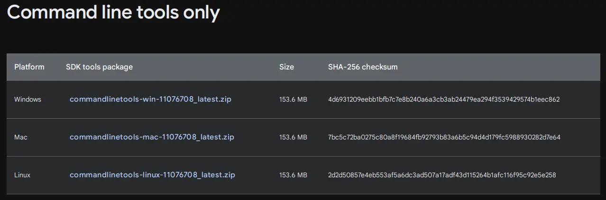
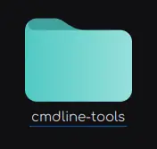
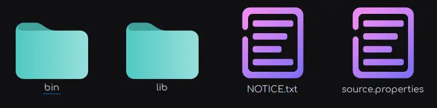

:::warning

This is not a easy task, Google makes you jump hoops, and steers you to installing Android Studio instead.

:::

## 1. Download "Command line tools only"

Firstly, visit [Android Developers](https://developer.android.com/studio) website. Then scroll down until you see `Command line tools only` section



:::tip

_Download_ and _extract_ the one that **matches your operating system**.

:::

This is the file stucture after extraction






## 2. Install "buildtools"

> The file you just extracted only the manager, which we need to install `buildtools`.

To install `buildtools`, open your terminal (command prompt on Windows) and type in:

* Linux/Mac
  ```sh
  /path/to/cmdline-tools/bin/sdkmanager --sdk_root=/path/to/cmdline-tools/android-35 "build-tools;35.0.0"
  ```

* Windows
  ```
  C:\Users\yourname\Downloads\cmdline-tools\bin\sdkmanager --sdk_root=C:\Users\yourname\Downloads\cmdline-tools\android-35 "build-tools;35.0.0"
  ```

You have to change `/path/to/cmdline-tool` on **Linux** and **Mac**, `C:\Users\yourname\Downloads\cmdline-tools` on **Windows**
to wherever you extracted the folder to.

`/path/to/cmdline-tools/android-35` and `C:\Users\yourname\Downloads\cmdline-tools\android-35` can be anywhere, you just have to remember it.

> _During the installation, one or several Term of Services (ToS) will be prompted to you, and you'll have to agree every single of them to continue._


## 3. Verify download

After all of that, new folder named `[sdk_root]/build-tools/35.0.0` is created.