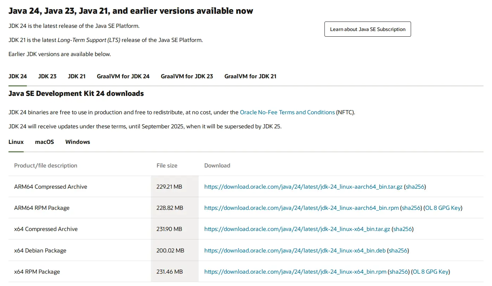

import Tabs from '@theme/Tabs';

import TabItem from '@theme/TabItem';

## What is Java?

Java is a programming language, but in this context, we are referring to JVM (Java virtual machine).

:::note[w3schools]

When we compile a Java program, then bytecode is generated. Bytecode is the source code that can be used to run on any platform [via JVM].

Source: https://www.w3schools.in/java/java-virtual-machine/

:::

:::info[abbreviations]

- JDK - **J**ava **D**evelopment **K**it
- JRE - **J**ava **R**untime **E**nvironment

:::

## Java version 21

Currently, the app requires **JDK 21** or **_higher_** to compile.

## How to download JDK 21?

JDK 21 can be downloaded at various websites. Here are some of them:

| Distributor                | Note                                | Link to download                                    |
|----------------------------|-------------------------------------|-----------------------------------------------------|
| OpenJDK                    | Worst WebUI                         | https://jdk.java.net/archive/                       |
| Adoptium (Eclipse Temurin) | More options                        | https://adoptium.net/temurin/releases/              |
| Oracle                     | Featuristic; Support latest version | https://www.oracle.com/java/technologies/downloads/ |

In this article, we will guide you through Oracle website, since they have
the most up-to-date Java and website is easy enough to navigate.

Download page contains just enough information about the version you're about to download:

* Version of Java\
  

* Operating system\
  

:::tip[Choosing the right package]

Oracle offers various method to install Java on your machine from executable file to compressed archive.

<Tabs>
  <TabItem value="linux" label="Linux">
    * Better to install by your package manager
    * Use compressed archive if you now what you're doing.
  </TabItem>
  <TabItem value="mac" label="Mac">
    * Intel chips use x64 package, M chips use ARM64
    * Use compressed archive if you now what you're doing.
  </TabItem>
  <TabItem value="Windows" label="Windows">
    * You should download `Installer` package. `MSI Installer` is for older machines.
    * Use compressed archive if you now what you're doing.
  </TabItem>
</Tabs>

:::

:::note

In the future, this section will be replaced with actual video going through the installation process.

:::
