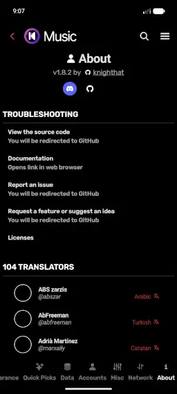

:::danger[Language]
Please explicitly use English while filling out the ticket.

Non-English tickets will be automatically closed after
a certain period if they are not translated into English.

> You don't have to excel in English, we can ask for more information if needed.
:::

## 📋 TODOs

Before you submit a ticket, please make sure that you've done these:

### Read articles about common issues/misconceptions

2 of the most common issues people have when using Kreate are about
playback. Either song stops in the middle, or their downloads
don't play when offline.

In most cases, this is not Kreate's fault. Please read [playback stops midway](/usr/faq/playback-stops-midway)
if you're experiencing similar problems mentioned above.

### Check issue page for similar issues

The reason why issues mentioned in [read articles about common issues/misconceptions](#read-articles-about-common-issuesmisconceptions)
are common because people **keep opening the same tickets**.

The app is currently maintained by [@KnightHat](https://github.com/knighthat). That means,
all development, distributing releases, and handling tickets are done by **1 single person**.

Every ticket must be examine carefully before taking actions, including duplicate tickets.
It takes a certain amount of time to do, so, if 10 tickets are the same, it'll take 10 times the time
to handle.

:::info
The more time a dev has to spend on ticket, the less time
he/she has to spend on development.
:::

## 📝 Filling out the form

:::warning[Incomplete tickets]
You are expected to fill out everything that is required in the form.

Incomplete tickets will be closed with or without notice.
:::

Each section are carefully designed to carry clues to pinpoint the problem,
the more you provide, the faster it gets fixed.

### Title

This is important, ticket's title must contains the problem you're facing.

For example, if the app crashes when you start a song, you can name the ticket
something like `App crashes when I select a song`.

<div class="callout">
  Please, for the love of God, don't name your ticket like this:
  `Crash`, `Bug`, `I don't know`, `alskdhj`, or any meaningless sentences.
</div>

### Version of Kreate

This is **the current version of Kreate**, you can find this in **Settings** > **About**



> For example, in this picture, the current version is `v1.8.2`
> Yours may be different, such as `v1.8.2-f`, `v1.8.2-fdroid`, etc.\
> **_Please make sure to write everything, not just the numbers._**

:::tip[Why is it important?]
Specifying the version lets the devs know when the first problem as reported.

You can also read [Choosing your build](/usr/choosing-your-build) to
know why some platforms don't have most up-to-date version.
:::

:::warning[Avoid using `latest` or `newest`]
Not all problems are solved in minutes, some take weeks or months.
Naming it `latest` or `newest` doesn't help, which will result in
your ticket being closed without notice.
:::

### Android version

This is the version of Android Kreate's running on when the issue occurs.

Kreate supports a wide range of Android devices, some features use different
algorithm for backward compatibility. If you specify incorrect version,
tests will be done incorrectly, results in unwanted outcomes.

> You can find your Android version in your **System Settings** > **About phone** > **Android version**.

Google's [Check & update your Android version](https://support.google.com/android/answer/7680439?hl=en).

> If you don't see your Android version on the list,
> please choose `Other` and specify it in [Other Android versions](#other-android-versions) section.

### Other Android versions

If you can replicate this issue on multiple devices with different Android versions,
or when you chose `Other` in [Android version](#android-version), please specify all
of them here.

:::tip
This section is **optional**
:::

### TODOs before submitting a ticket

Just like [TODOs](#-todos), there are things needed to be done beforehand.

- **Update my app to latest version**: Your issue could be fixed in recent version.
  Check latest on our GitHub's [releases](https://github.com/knighthat/Kreate/releases/latest) page.
  If versions are mismatch, please promptly update your app, or wait if your distribution platform
  to ship new update.
- **(If I'm on latest version) Re-install app**: Some issues occurred during installation/update process,
  but the crash won't happen until you use the app. This can be solved most of the time by install
  the same APK on top or just remove and make a fresh install on your phone.
- **I have checked issue page and there's no problem like mine**:
  Similar to [Check Issue page for similar issues](#check-issue-page-for-similar-issues)

:::warning
Checking these boxes means you've done **ALL** of them.

**Failure to fulfil either of them will result in your ticket being closed without notice.**
:::

### Tell us how to trigger this bug

This is where you describe how to you trigger the issue. This is very **_important_**.

This should be 1 line per step. Here's an example:

```
1. Open Kreate
2. Go to page A
3. Click on an item
4. Scroll or wait [amount of time]
5. Crash happens
```

:::tip
Provide as much as information you can give. Sometimes the detail is what determines the outcome
:::

:::warning
If you have crash log(s), don't paste them here, use [Log(s)](#logs) section instead.
:::

### Submit a video/picture

It's always good to have a short video to backup all your description.

:::tip
If the issue in question is a visual defect, you can submit a screenshot instead.
:::

You can read [Attaching files](https://docs.github.com/en/get-started/writing-on-github/working-with-advanced-formatting/attaching-files)
from GitHub for details. TL;DR:

| | Video | Image |
| - | - | - |
| Specs | Encoded using H264, less than 10MB | Less than 10MB |
| [Supported formats](https://docs.github.com/en/get-started/writing-on-github/working-with-advanced-formatting/attaching-files#image-and-media-files) | mp4, mov, webm | png, gif, jpg, jpeg, svg |

<iframe width="560" height="315" src="https://www.youtube-nocookie.com/embed/h6fOErvWIGI?si=-APhgt6L2Py3uRQ8" title="YouTube video player" frameborder="0" allow="accelerometer; autoplay; clipboard-write; encrypted-media; gyroscope; picture-in-picture; web-share" referrerpolicy="strict-origin-when-cross-origin" allowfullscreen></iframe>

### Log(s)

You can find and get both `Runtime log` and `Crash log` in **Settings** > **Misc**.

> Enabling `Runtime log` requires you to restart the app, so you need to reenact the steps to get it logged

Crash log will be presented to you on next start after the crash. You can click on copy icon,
or `Open issue ticket` to copy the log to your clipboard, the latter option opens issue page
after copying the log.

Log must be posted as an attachment, or pasted in plain text inside a spoiler (HTML details tag).
Replace `<Paste your log here>` with your actual log in the example below

```
<details>
  <summary>Logs</summary>
  <Paste your log here>
</details>
```

:::tip[Runtime log]
Runtime log is highly recommended, it contains events happen before, during, and after the crash.

If you have multiple logs, please copy "details" for each log, name them appropriately, make sure they are different from each other
:::

:::warning[Crash log]
Crash log is mandatory when you open crash report.

Failure to provide this log will result to your ticket being closed.
:::
