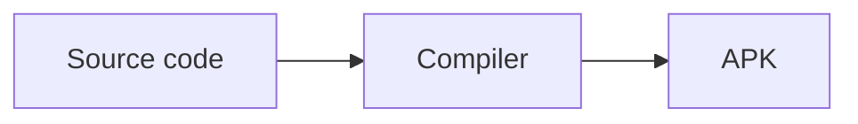
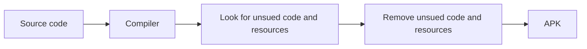

## 📏 Short answer

There's **NO DIFFERENCE** between `uncompressed` and `release` versions of the app.

The only difference is their sizes.

## ⚙️ How is it made?

As you may know, compiler takes current state of the code and translates it 
into something a machine can understand.

`uncompressed` version is the direct translation of the source code to APK with little
to no change.

`release` version has an extra step executed during compilation. This step removes
all unused code, resources before finalizing the APK. Thus, making size of `release`
smaller than `uncompressed`.

## 🤔 Which one should I use?

Always `release`

## 🔄 I installed `uncompressed` version, can I switch?

Yes, you can switch between versions with no hassle.

:::info[having trouble?]

Report it [here](https://github.com/knighthat/Kreate/issues/new?template=bug_report.yaml)

:::

:::warning[always backup your data before attempting to update]
:::

## ❓ Why `uncompressed` version exists?

Nothing is perfect, sometimes `release` can cause trouble during installation.
Therefore, `uncompressed` version is still included in release post to help those having
problems continue to use app.