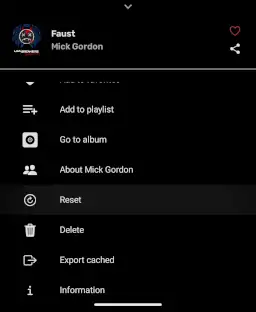
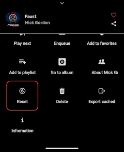
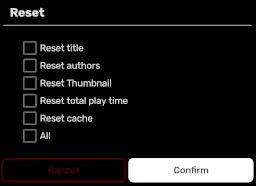

This feature allows you to remove all changes made to a song, this also includes resetting song's cache.

## ❓ Where is it?

You can access this feature by going to song's menu, and then choose `Reset` option

| List menu | Grid menu |
| --------- | --------- |
|  |  |

:::tip
Scroll down if you don't see it
:::

## 💭 Reset dialog

This dialog will help you fine-tune what property of this song to be reset.

### Title

If current title was modified, this will get this song's current title from YouTube Music
and set it back. If it wasn't, this feature will attempt to update current title to YTM's version

### Authors

Similarly to [title](#title), reset if modified, otherwise, update current value.

### Thumbnail

Reset or update current thumbnail, similar to [title](#title) and [authors](#authors).

### Total play time

Reset your play time on this song to **0**.

:::info
This will not delete history entries.
:::

### Cache

This will attempt to delete every thing related to playback of this song. From cache,
download, to cached stream url.

:::tip
You can use this to completely remove any cached portion of the song from your device.

You can also use this if the song keeps stopping during playback
:::

### All

Short-hand checkbox that selects everything else for you.

When you uncheck 1 of the above boxes, this box will uncheck itself automatically.

## ✅ Confirm / ❌ Cancel

Toggling checkboxes doesn't actually apply the action, this is intended for fool-proof reason.

Hitting `Cancel` or pressing outside the dialog will close the dialog without doing anything else.

Hitting `Confirm` will  enact all selected actions above. If none selected, it'll just close the dialog
