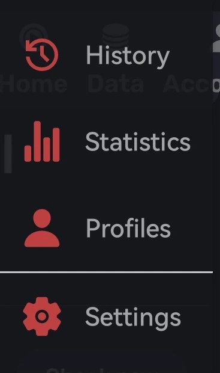
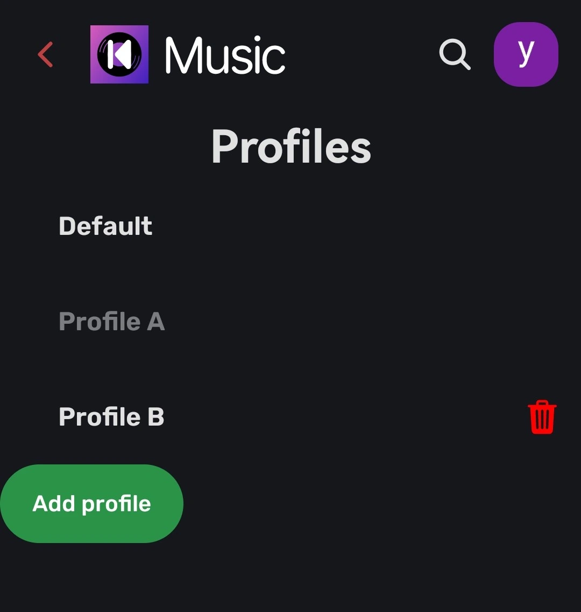
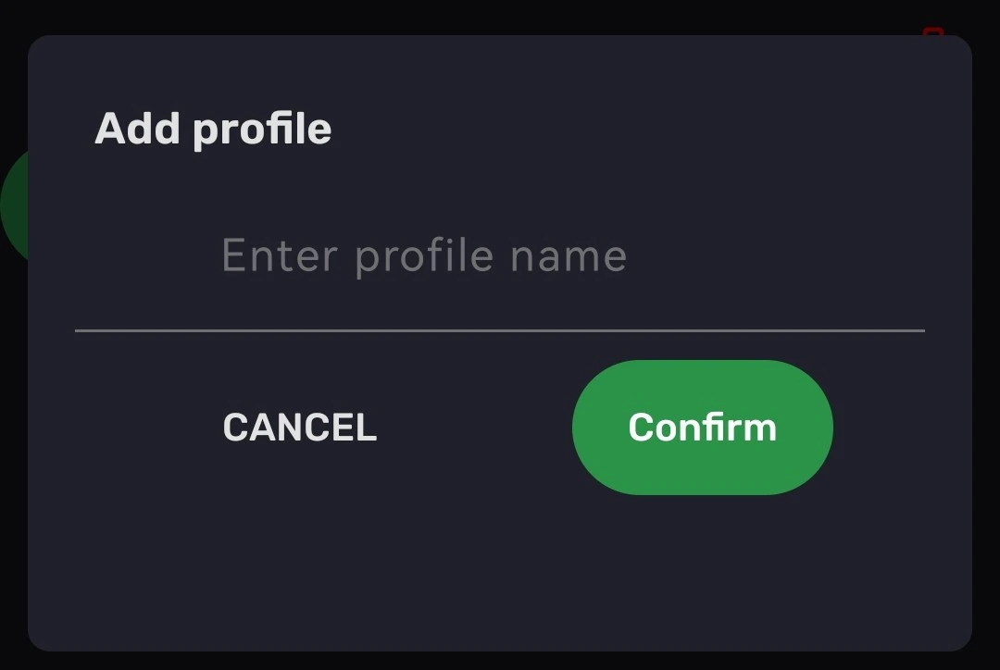

This feature allows you to have multiple profiles on the same phone, each with it's own settings.

## ❓ Where is it?

You can access this feature by going to the hamburger menu, and then choose the `Profiles` option.

## 📱Profiles screen

This screen let you access your profiles and create new one's.

### Switch profie

Just click on the profile you want to switch to.

:::note
This will required to restart the app.
:::

#### Restart popup

This popup will open when you try to switch profile.

Hitting `Cancel` or pressing outside the dialog will close the dialog without doing anything else.

Hitting `Confirm` will close the app and switch the profile, open the app back again and start using the new profile .

### Add profile

This button let you add a new profile, it will open a popup letting you choose a name.

#### Add profile popup

In this popup you need to choose a name for your new profile.

Hitting `Cancel` or pressing outside the dialog will close the dialog without doing else.

Hitting `Confirm` will create a new profile with the name prompted, if a name wasn't provided - the input for name will turn red, if the profile already exist - a new popup will open telling you that profile already exist.

:::info
This will not switch profile, to switch profile see [Switch Profile](#switch-profile).
:::
