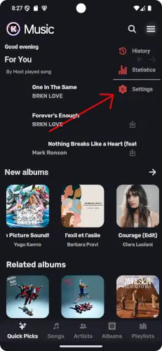
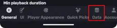
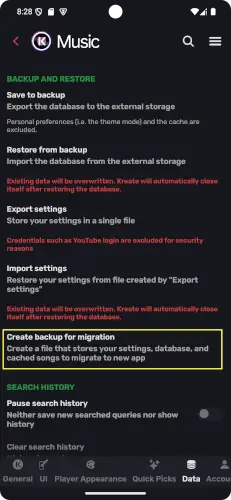
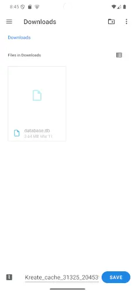
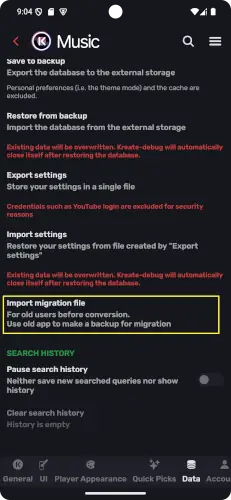
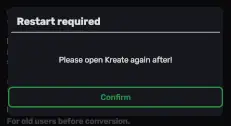

## <svg xmlns="http://www.w3.org/2000/svg" width="1em" height="1em" viewBox="0 0 24 24"><path fill="#fff" d="M10.6 16q0-2.025.363-2.912T12.5 11.15q1.025-.9 1.563-1.562t.537-1.513q0-1.025-.687-1.7T12 5.7q-1.275 0-1.937.775T9.125 8.05L6.55 6.95q.525-1.6 1.925-2.775T12 3q2.625 0 4.038 1.463t1.412 3.512q0 1.25-.537 2.138t-1.688 2.012Q14 13.3 13.738 13.913T13.475 16zm1.4 6q-.825 0-1.412-.587T10 20t.588-1.412T12 18t1.413.588T14 20t-.587 1.413T12 22"/></svg> What is this?

[@knighthat](https://github.com/knighthat) releases a feature on old Kreate (`improvised` and `upstream` flavor) that allows user to seamlessly move their caches, database(s), and settings to new Kreate without breaking a sweat.

> Old Kreate will stop receving updates after Mar 16 2025, unless it's related to migration issue.

:::note

Old Kreate will work, we don't break software to force update.

:::

:::warning

External API such as YouTube Music API **will** stop working one day, we can't do nothing about it, updating software to new version is the only way.

:::

## <svg xmlns="http://www.w3.org/2000/svg" width="1em" height="1em" viewBox="0 0 32 32"><path fill="#fff" d="M26 2H6a2 2 0 0 0-2 2v4a2 2 0 0 0 2 2h9v6.17l-2.59-2.58L11 15l5 5l5-5l-1.41-1.41L17 16.17V10h9a2 2 0 0 0 2-2V4a2 2 0 0 0-2-2M6 4h4v4H6zm20 4H12V4h14zm0 14H6a2 2 0 0 0-2 2v4a2 2 0 0 0 2 2h20a2 2 0 0 0 2-2v-4a2 2 0 0 0-2-2M6 24h14v4H6zm20 4h-4v-4h4z"/></svg> Should I migrate my data?

If you have more than a few dozens of songs cached or downloaded, or you have all settings setup to your need and you don't feel like setting them up again, then the answer is **YES**!

If you are trying out the app and have not many to lose, I'd advise against it.

:::note

If you are not on `improvised` or `upstream` build, you are not required to migrate.

:::

## <svg xmlns="http://www.w3.org/2000/svg" width="1em" height="1em" viewBox="0 0 24 24"><path fill="#fff" d="M13 9V3.5L18.5 9M6 2c-1.11 0-2 .89-2 2v16a2 2 0 0 0 2 2h12a2 2 0 0 0 2-2V8l-6-6z"/></svg> Create migration file

1. Go to  **Settings** > **Data** and look for **Create backup for migration**.

    

    

    

2. Name your backup

    :::tip

    Default name will be assigned if you hit **_confirm_** with empty value

    :::

    

3. Select location

    > This is where your migration file is saved to, *_remember it_*

    :::note

    Each device has their own interface. But it should have some resemblance to the illustration below

    :::

    

## <svg xmlns="http://www.w3.org/2000/svg" width="1em" height="1em" viewBox="0 0 24 24"><path fill="#fff" d="M3 1h12.414L21 6.586V23h-9v-2h7V9h-6V3H5v10H3zm12 2.414V7h3.586zM7.05 14.088l4.858 4.914l-4.858 4.914l-1.422-1.406l2.48-2.508H.997v-2h7.11l-2.48-2.508z"/></svg> Import migration file

1. Install new Kreate

    > Remember to download `Kreate-full.apk` or `Kreate-upstream.apk` only.

    

1. Go to  **Settings** > **Data** and look for **Create backup for migration**.

    

    

    

2. Select migration file

    

3. Restart your app

    :::warning

    Failure to restart your app may cause data corruption

    :::

    

## <svg xmlns="http://www.w3.org/2000/svg" width="1em" height="1em" viewBox="0 0 24 24"><path fill="#fff" d="M6 19c0 1.1.9 2 2 2h8c1.1 0 2-.9 2-2V7H6zM19 4h-3.5l-1-1h-5l-1 1H5v2h14z"/></svg> Delete old Kreate (optional)

You can safely delete your old Kreate and move on to new app. 

But my advice is to use new Kreate for few days to detect any anomaly before completely delete old Kreate