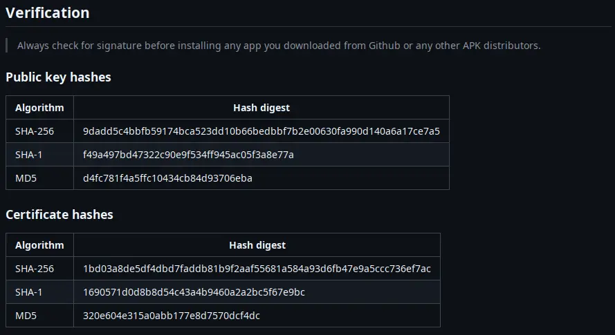
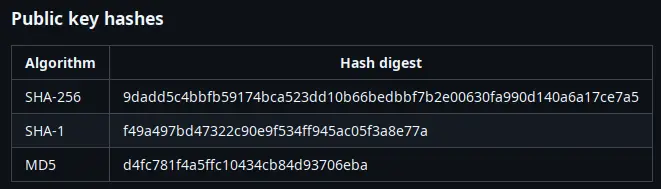
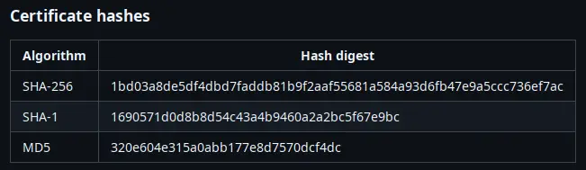

Each APK published is signed by a set of signature. **ONLY INSTALL** from signatures listed in the post.

It is **extremely important** to verify signatures of each download you obtain from the internet.

## ❓ Why?

The signature in an APK is crucial for security, integrity, and trust. Here’s why:

1. <svg xmlns="http://www.w3.org/2000/svg" width="1em" height="1em" viewBox="0 0 512 512"><path fill="#fff" d="M479.07 111.36a16 16 0 0 0-13.15-14.74c-86.5-15.52-122.61-26.74-203.33-63.2a16 16 0 0 0-13.18 0C168.69 69.88 132.58 81.1 46.08 96.62a16 16 0 0 0-13.15 14.74c-3.85 61.11 4.36 118.05 24.43 169.24A349.5 349.5 0 0 0 129 393.11c53.47 56.73 110.24 81.37 121.07 85.73a16 16 0 0 0 12 0c10.83-4.36 67.6-29 121.07-85.73a349.5 349.5 0 0 0 71.5-112.51c20.07-51.19 28.28-108.13 24.43-169.24m-131 75.11l-110.8 128a16 16 0 0 1-11.41 5.53h-.66a16 16 0 0 1-11.2-4.57l-49.2-48.2a16 16 0 1 1 22.4-22.86l37 36.29l99.7-115.13a16 16 0 0 1 24.2 20.94Z"/></svg> **App Integrity** – The signature ensures the APK has not been tampered with after being signed. If modified, the signature becomes invalid.
2. <svg xmlns="http://www.w3.org/2000/svg" width="1em" height="1em" viewBox="0 0 24 24"><path fill="#fff" d="M10.95 19.55q.5.3 1.05.288t1.05-.313l4.55-2.775q-1.25-.875-2.675-1.312T12 15t-2.937.438t-2.713 1.287zM12 13q1.45 0 2.475-1.025T15.5 9.5t-1.025-2.475T12 6T9.525 7.025T8.5 9.5t1.025 2.475T12 13m-1.05 8.875l-7-4.3q-.45-.275-.7-.725T3 15.875v-7.75q0-.525.25-.975t.7-.725l7-4.3q.5-.3 1.05-.3t1.05.3l7 4.3q.45.275.7.725t.25.975v7.75q0 .525-.25.975t-.7.725l-7 4.3q-.5.3-1.05.3t-1.05-.3"/></svg> **Developer Identity** – It verifies that the app comes from a trusted developer. Users and the Play Store can confirm that updates come from the same developer.
3. <svg xmlns="http://www.w3.org/2000/svg" width="1em" height="1em" viewBox="0 0 24 24"><path fill="#fff" d="M9.71 11.29a1 1 0 0 0-1.42 1.42l3 3A1 1 0 0 0 12 16a1 1 0 0 0 .72-.34l7-8a1 1 0 0 0-1.5-1.32L12 13.54Z"/><path fill="#fff" d="M21 11a1 1 0 0 0-1 1a8 8 0 0 1-8 8A8 8 0 0 1 6.33 6.36A7.93 7.93 0 0 1 12 4a8.8 8.8 0 0 1 1.9.22a1 1 0 1 0 .47-1.94A10.5 10.5 0 0 0 12 2a10 10 0 0 0-7 17.09A9.93 9.93 0 0 0 12 22a10 10 0 0 0 10-10a1 1 0 0 0-1-1"/></svg> **Update Verification** – Android requires that app updates be signed with the same key as the installed version. This prevents unauthorized updates.

### <svg xmlns="http://www.w3.org/2000/svg" width="1em" height="1em" viewBox="0 0 26 26"><path fill="none" stroke="#fff" stroke-linejoin="round" stroke-width="2" d="m4 8l9-5l9 5v9.7L13 23l-9-5.2zm9 5L4 8m9 5l9-5m-9 5v10"/></svg> App Integrity

Signature protects APK from being modified by bad actors. After an APK is signed, any modification to the APK will break the signature, 
thus, making the signature invalid. [Learn more about APK signing process](https://developer.android.com/studio/publish/app-signing)

### <svg xmlns="http://www.w3.org/2000/svg" width="1em" height="1em" viewBox="0 0 24 24"><path fill="#fff" d="M10.95 19.55q.5.3 1.05.288t1.05-.313l4.55-2.775q-1.25-.875-2.675-1.312T12 15t-2.937.438t-2.713 1.287zM12 13q1.45 0 2.475-1.025T15.5 9.5t-1.025-2.475T12 6T9.525 7.025T8.5 9.5t1.025 2.475T12 13m-1.05 8.875l-7-4.3q-.45-.275-.7-.725T3 15.875v-7.75q0-.525.25-.975t.7-.725l7-4.3q.5-.3 1.05-.3t1.05.3l7 4.3q.45.275.7.725t.25.975v7.75q0 .525-.25.975t-.7.725l-7 4.3q-.5.3-1.05.3t-1.05-.3"/></svg> Developer Identity

Signature contains 2 keys, one public and one private.

* Public key is used for verification
* Private key can only be used to digitally sign the APK

In short, `private key` can generate signature that is encrypted and only corresponding `public key` can verify if the signature is valid.

In case of APK, signed `.apk` files contain _public key hashes_, which can be used to verify against _public key hashes_ published by the developers.

### <svg xmlns="http://www.w3.org/2000/svg" width="1em" height="1em" viewBox="0 0 24 24"><path fill="#fff" d="M4 20q-.825 0-1.412-.587T2 18V6q0-.825.588-1.412T4 4h16q.825 0 1.413.588T22 6v12q0 .825-.587 1.413T20 20zM4 8h16V6H4zm6.95 8.55l5.65-5.65l-1.45-1.45l-4.2 4.2l-2.1-2.1L7.4 13z"/></svg> Update Verification

For security reason, Android requires all APKs must be signed to be installed on your machine.
Furthermore, update APKs require to have the same signature as the installed one.

:::note

For this reason, APK installed by APK distributor (such as FDroid, Google Play, etc.) cannot be
install on the same machine (despite having the same appId).

:::

## <svg xmlns="http://www.w3.org/2000/svg" width="1em" height="1em" viewBox="0 0 24 24"><path fill="#fff" fill-rule="evenodd" d="M15.418 5.643a1.25 1.25 0 0 0-1.34-.555l-1.798.413a1.25 1.25 0 0 1-.56 0l-1.798-.413a1.25 1.25 0 0 0-1.34.555l-.98 1.564c-.1.16-.235.295-.395.396l-1.564.98a1.25 1.25 0 0 0-.555 1.338l.413 1.8a1.25 1.25 0 0 1 0 .559l-.413 1.799a1.25 1.25 0 0 0 .555 1.339l1.564.98c.16.1.295.235.396.395l.98 1.564c.282.451.82.674 1.339.555l1.798-.413a1.25 1.25 0 0 1 .56 0l1.799.413a1.25 1.25 0 0 0 1.339-.555l.98-1.564c.1-.16.235-.295.395-.395l1.565-.98a1.25 1.25 0 0 0 .554-1.34L18.5 12.28a1.25 1.25 0 0 1 0-.56l.413-1.799a1.25 1.25 0 0 0-.554-1.339l-1.565-.98a1.25 1.25 0 0 1-.395-.395zm-.503 4.127a.5.5 0 0 0-.86-.509l-2.615 4.426l-1.579-1.512a.5.5 0 1 0-.691.722l2.034 1.949a.5.5 0 0 0 .776-.107z" clip-rule="evenodd"/></svg> How can I verify your APK

Verify simple, each release post has a section called `Verification`, use this compare against
`.apk` file by following one of these methods below



> Future posts should have the same hashes unless explicitly stated that they are different.

Next step is to obtain a copy of `.apk` file and follow one of these steps

### 🫆 By using `apksigner`

`apksigner` is an application provided by Google to developers to sign their apps, but you can use it verify `.apk` file too.

:::warning

This is not a easy task, Google makes you jump hoops, and steers you to installing Android Studio instead.
But Android Studio is not something you need for verifying signature of an APK file.

:::

#### 1. Download "Command line tools only"

We have separate instructions on how to install "buildtools", [read it](/dev/guides/how-to-install-buildtools).

#### 3. Verify signature

After all of that, `apksigner` is now available at `[sdk_root]/build-tools/35.0.0/apksigner`

Now, execute this command to get all signatures and more:

* Linux/Mac
  ```sh
  [sdk_root]/build-tools/35.0.0/apksigner verify -v /path/to/Kreate-minified.apk
  ```
* Windows <svg xmlns="http://www.w3.org/2000/svg" width="1em" height="1em" viewBox="0 0 24 24"><path fill="#fff" d="m3.001 5.479l7.377-1.016v7.127H3zm0 13.042l7.377 1.017v-7.04H3zm8.188 1.125L21.001 21v-8.502h-9.812zm0-15.292v7.236h9.812V3z"/></svg>

  ```sh
  [sdk_root]\build-tools\35.0.0\apksigner verify -v /path/to/Kreate-minified.apk
  ```

A lot of lines will be printed out, but what we need lies up top, scroll up the terminal until you see

```sh
❯ [sdk_root]/build-tools/35.0.0/apksigner verify --print-certs -v /path/to/Kreate-minified.apk
Verifies
Verified using v1 scheme (JAR signing): true
Verified using v2 scheme (APK Signature Scheme v2): true
Verified using v3 scheme (APK Signature Scheme v3): true
Verified using v3.1 scheme (APK Signature Scheme v3.1): false
Verified using v4 scheme (APK Signature Scheme v4): false
Verified for SourceStamp: false
Number of signers: 1
Signer #1 certificate DN: C=US, ST=Texas, L=Houston, O=KnightHat, OU=Kreate, CN=Tan Nguyen
Signer #1 certificate SHA-256 digest: 1bd03a8de5df4dbd7faddb81b9f2aaf55681a584a93d6fb47e9a5ccc736ef7ac
Signer #1 certificate SHA-1 digest: 1690571d0d8b8d54c43a4b9460a2a2bc5f67e9bc
Signer #1 certificate MD5 digest: 320e604e315a0abb177e8d7570dcf4dc
Signer #1 key algorithm: RSA
Signer #1 key size (bits): 2048
Signer #1 public key SHA-256 digest: 9dadd5c4bbfb59174bca523dd10b66bedbbf7b2e00630fa990d140a6a17ce7a5
Signer #1 public key SHA-1 digest: f49a497bd47322c90e9f534ff945ac05f3a8e77a
Signer #1 public key MD5 digest: d4fc781f4a5ffc10434cb84d93706eba
```

In this tutorial, we only need to focus on 3 lines:

```sh
Signer #1 public key SHA-256 digest: 9dadd5c4bbfb59174bca523dd10b66bedbbf7b2e00630fa990d140a6a17ce7a5
Signer #1 public key SHA-1 digest: f49a497bd47322c90e9f534ff945ac05f3a8e77a
Signer #1 public key MD5 digest: d4fc781f4a5ffc10434cb84d93706eba
```

Now compare with _public key hashes_



If all digests are identical, you are safe to install the app.

:::danger[Report if you see]

* More than 1 signer
* Keys are not matched

Delete `.apk` immediately and report it [HERE](https://github.com/knighthat/Kreate/issues)

:::

### <svg xmlns="http://www.w3.org/2000/svg" width="1em" height="1em" viewBox="0 0 24 24"><g fill="none" stroke="#fff" stroke-width="1.5"><path stroke-linecap="round" stroke-linejoin="round" d="M21.067 5c.592.958.933 2.086.933 3.293c0 3.476-2.83 6.294-6.32 6.294c-.636 0-2.086-.146-2.791-.732l-.882.878c-.735.732-.147.732.147 1.317c0 0 .735 1.025 0 2.05c-.441.585-1.676 1.404-3.086 0l-.294.292s.881 1.025.147 2.05c-.441.585-1.617 1.17-2.646.146l-1.028 1.024c-.706.703-1.568.293-1.91 0l-.883-.878c-.823-.82-.343-1.708 0-2.05l7.642-7.61s-.735-1.17-.735-2.78c0-3.476 2.83-6.294 6.32-6.294c.819 0 1.601.155 2.319.437"/><path d="M17.885 8.294a2.2 2.2 0 0 1-2.204 2.195a2.2 2.2 0 0 1-2.205-2.195a2.2 2.2 0 0 1 2.205-2.196a2.2 2.2 0 0 1 2.204 2.196Z"/></g></svg> By using Java's `keytool`

> So far, this is a more friendly way to verify signatures of `.apk` files.

Java comes with `keytool` by default, the installation process is very straight forward.

:::tip[If you've already installed Java]

Go to [step 2](#)

:::

#### 1. Install "Java" <svg xmlns="http://www.w3.org/2000/svg" width="1em" height="1em" viewBox="0 0 256 256"><g fill="none"><rect width="256" height="256" fill="#242938" rx="60"/><path fill="#fff" d="M101.634 182.619s-7.68 4.674 5.345 6.011c15.728 2.004 24.044 1.669 41.407-1.668c0 0 4.674 3.009 11.02 5.344c-39.075 16.696-88.497-1.002-57.772-9.687m-5.009-21.705s-8.35 6.346 4.674 7.679c17.028 1.669 30.391 2.004 53.433-2.667c0 0 3.009 3.341 8.015 5.01c-47.083 14.025-99.85 1.333-66.122-10.019zm92.17 38.07s5.676 4.674-6.346 8.35c-22.376 6.678-93.839 8.685-113.876 0c-7.009-3.009 6.347-7.352 10.686-8.015c4.342-1.002 6.678-1.002 6.678-1.002c-7.68-5.344-51.095 11.02-22.041 15.729c79.813 13.027 145.603-5.676 124.896-15.028zm-83.488-60.781s-36.402 8.685-13.028 11.687c10.019 1.333 29.721 1.002 48.089-.335c15.028-1.334 30.09-4.007 30.09-4.007s-5.345 2.338-9.017 4.674c-37.099 9.693-108.23 5.351-87.858-4.668c17.37-8.35 31.724-7.351 31.724-7.351m65.116 36.401c37.407-19.37 20.037-38.07 8.015-35.731c-3.009.667-4.342 1.334-4.342 1.334s1.001-2.004 3.34-2.667c23.709-8.35 42.413 25.046-7.679 38.07c0 0 .335-.335.666-1.002zm-61.444 52.76c36.067 2.339 91.168-1.334 92.505-18.369c0 0-2.667 6.678-29.72 11.688c-30.722 5.676-68.796 5.009-91.168 1.333c0 0 4.674 4.007 28.386 5.344z"/><path fill="#f58219" d="M147.685 28s20.704 21.039-19.702 52.76c-32.394 25.712-7.351 40.408 0 57.101c-19.035-17.028-32.722-32.059-23.377-46.085C118.331 71.083 156.062 61.064 147.685 28M137 123.842c9.683 11.02-2.667 21.039-2.667 21.039s24.711-12.686 13.359-28.387c-10.354-15.028-18.368-22.376 25.046-47.425c0 0-68.46 17.028-35.731 54.766z"/></g></svg>

We have separate instructions on how to install Java 21, [read it](/dev/guides/how-to-install-java-21).

#### 2. Verify certificate <svg xmlns="http://www.w3.org/2000/svg" width="1em" height="1em" viewBox="0 0 24 24"><path fill="#fff" d="M4.75 3A2.75 2.75 0 0 0 2 5.75V11a5 5 0 0 1 8 6v1h9.25A2.75 2.75 0 0 0 22 15.25v-9.5A2.75 2.75 0 0 0 19.25 3zm2 4h10.5a.75.75 0 0 1 0 1.5H6.75a.75.75 0 0 1 0-1.5M12 12.75a.75.75 0 0 1 .75-.75h4.5a.75.75 0 0 1 0 1.5h-4.5a.75.75 0 0 1-.75-.75M6 10a4 4 0 1 0 0 8.001A4 4 0 0 0 6 10m3 8.001c-.835.628-1.874 1-3 1a4.98 4.98 0 0 1-3-.998v3.246c0 .57.605.92 1.09.669l.09-.055L6 20.592l1.82 1.272a.75.75 0 0 0 1.172-.51L9 21.249z"/></svg>

Unlike `apksigner`, you can't print _public key hashes_, but you can print _certificate hashes_.

Open your terminal (on Linux or Mac) or Command Prompt on Windows machines and type:

```sh
keytool -printcert -v -jarfile /path/to/Kreate-minified.apk
```

:::note

On Windows, replace `/` with `\`.

Replace `/path/to/Kreate-minified.apk` to path you saved `.apk` file to

:::

This should be the outputs from the command above

```sh
❯ keytool -printcert -v -jarfile /path/to/Kreate-minified.apk
Signer #1:

Certificate #1:
Owner: C=US, ST=Texas, L=Houston, O=KnightHat, OU=Kreate, CN=Tan Nguyen
Issuer: C=US, ST=Texas, L=Houston, O=KnightHat, OU=Kreate, CN=Tan Nguyen
Serial number: 1
Valid from: Wed Mar 12 22:51:59 CDT 2025 until: Sun Mar 06 21:51:59 CST 2050
Certificate fingerprints:
         SHA1: 16:90:57:1D:0D:8B:8D:54:C4:3A:4B:94:60:A2:A2:BC:5F:67:E9:BC
         SHA256: 1B:D0:3A:8D:E5:DF:4D:BD:7F:AD:DB:81:B9:F2:AA:F5:56:81:A5:84:A9:3D:6F:B4:7E:9A:5C:CC:73:6E:F7:AC
Signature algorithm name: SHA256withRSA
Subject Public Key Algorithm: 2048-bit RSA key
Version: 1
```

Now compare it to published _certificate hashes_ from release post.



:::danger[Small problem, they are not in the same format!]
:::

You're right, but it's very simple to convert between formats.

Let's take 1 of each for comparison

* From release post
  ```
  1690571d0d8b8d54c43a4b9460a2a2bc5f67e9bc
  ```
* From `keytool`
  ```
  16:90:57:1D:0D:8B:8D:54:C4:3A:4B:94:60:A2:A2:BC:5F:67:E9:BC
  ```

If you look closely, you'll see that `keytool` just prints a easier-to-read version of release post.

1. Capitalize all characters in first hash and place colon (`:`) on every third position. Or,
2. Remove all colon (`:`) and decapitalize all characters in keytool's version generates the same result.

If all digests are identical, you are safe to install the app.

:::danger[Report if you see]

* More than 1 signer
* Keys are not matched

Delete `.apk` immediately and report it [HERE](https://github.com/knighthat/Kreate/issues)

:::