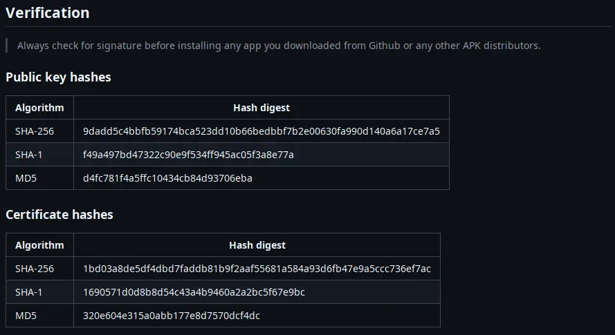

import Tabs from '@theme/Tabs';

import TabItem from '@theme/TabItem';

Each APK published is signed by a set of signature. **ONLY INSTALL** from signatures listed in the post.

It is **extremely important** to verify signatures of each download you obtain from the internet.

## ❓ Why?

The signature in an APK is crucial for security, integrity, and trust. Here’s why:

1. 🛡️ **App Integrity** – The signature ensures the APK has not been tampered with after being signed. If modified, the signature becomes invalid.
2. 👤 **Developer Identity** – It verifies that the app comes from a trusted developer. Users and the Play Store can confirm that updates come from the same developer.
3. ⏫ **Update Verification** – Android requires that app updates be signed with the same key as the installed version. This prevents unauthorized updates.

### 🛡️ App Integrity

Signature protects APK from being modified by bad actors. After an APK is signed, any modification to the APK will break the signature, 
thus, making the signature invalid. [Learn more about APK signing process](https://developer.android.com/studio/publish/app-signing)

### 👤 Developer Identity

Signature contains 2 keys, one public and one private.

* Public key is used for verification
* Private key can only be used to digitally sign the APK

In short, `private key` can generate signature that is encrypted and only corresponding `public key` can verify if the signature is valid.

In case of APK, signed `.apk` files contain _public key hashes_, which can be used to verify against _public key hashes_ published by the developers.

### ⏫ Update Verification

For security reason, Android requires all APKs must be signed to be installed on your machine.
Furthermore, update APKs require to have the same signature as the installed one.

:::note

For this reason, APK installed by APK distributor (such as FDroid, Google Play, etc.) cannot be
install on the same machine (despite having the same appId).

:::

## 🛠️ How can I verify your APK

Verify simple, each release post has a section called `Verification`, use this compare against
`.apk` file by following one of these methods below



> Future posts should have the same hashes unless explicitly stated that they are different.

Next step is to obtain a copy of `.apk` file and follow one of these steps

### 🫆 By using `apksigner`

`apksigner` is an application provided by Google to developers to sign their apps, but you can use it verify `.apk` file too.

:::warning

This is not a easy task, Google makes you jump hoops, and steers you to installing Android Studio instead.
But Android Studio is not something you need for verifying signature of an APK file.

:::

#### 1. Download "Command line tools only"

Firstly, visit [Android Developers](https://developer.android.com/studio) website. Then scroll down until you see `Command line tools only` section


:::tip

_Download_ and _extract_ the one that **matches your operating system**.

:::

This is the file stucture after extraction


#### 2. Install "apksigner"

> The file you just extracted only the manager, which we need install `apksigner`.

To install `apksigner`, open your terminal (command prompt on Windows) and type in:

* Linux/Mac
  ```sh
  /path/to/cmdline-tools/bin/sdkmanager --sdk_root=/path/to/cmdline-tools/android-35 "build-tools;35.0.0"
  ```

* Windows
  ```
  C:\Users\yourname\Downloads\cmdline-tools\bin\sdkmanager --sdk_root=C:\Users\yourname\Downloads\cmdline-tools\android-35 "build-tools;35.0.0"
  ```

You have to change `/path/to/cmdline-tool` on **Linux** and **Mac**, `C:\Users\yourname\Downloads\cmdline-tools` on **Windows**
to wherever you extracted the folder to.

`/path/to/cmdline-tools/android-35` and `C:\Users\yourname\Downloads\cmdline-tools\android-35` can be anywhere, you just have to remember it.

> _During the installation, one or several Term of Services (ToS) will be prompted to you, and you'll have to agree every single of them to continue._

#### 3. Verify signature

After all of that, `apksigner` is now available at `[sdk_root]/build-tools/35.0.0/apksigner`

Now, execute this command to get all signatures and more:

* Linux/Mac
  ```sh
  [sdk_root]/build-tools/35.0.0/apksigner verify -v /path/to/Kreate-minified.apk
  ```
* Windows
  ```sh
  [sdk_root]\build-tools\35.0.0\apksigner verify -v /path/to/Kreate-minified.apk
  ```

A lot of lines will be printed out, but what we need lies up top, scroll up the terminal until you see

```sh
❯ [sdk_root]/build-tools/35.0.0/apksigner verify --print-certs -v /path/to/Kreate-minified.apk
Verifies
Verified using v1 scheme (JAR signing): true
Verified using v2 scheme (APK Signature Scheme v2): true
Verified using v3 scheme (APK Signature Scheme v3): true
Verified using v3.1 scheme (APK Signature Scheme v3.1): false
Verified using v4 scheme (APK Signature Scheme v4): false
Verified for SourceStamp: false
Number of signers: 1
Signer #1 certificate DN: C=US, ST=Texas, L=Houston, O=KnightHat, OU=Kreate, CN=Tan Nguyen
Signer #1 certificate SHA-256 digest: 1bd03a8de5df4dbd7faddb81b9f2aaf55681a584a93d6fb47e9a5ccc736ef7ac
Signer #1 certificate SHA-1 digest: 1690571d0d8b8d54c43a4b9460a2a2bc5f67e9bc
Signer #1 certificate MD5 digest: 320e604e315a0abb177e8d7570dcf4dc
Signer #1 key algorithm: RSA
Signer #1 key size (bits): 2048
Signer #1 public key SHA-256 digest: 9dadd5c4bbfb59174bca523dd10b66bedbbf7b2e00630fa990d140a6a17ce7a5
Signer #1 public key SHA-1 digest: f49a497bd47322c90e9f534ff945ac05f3a8e77a
Signer #1 public key MD5 digest: d4fc781f4a5ffc10434cb84d93706eba
```

In this tutorial, we only need to focus on 3 lines:

```sh
Signer #1 public key SHA-256 digest: 9dadd5c4bbfb59174bca523dd10b66bedbbf7b2e00630fa990d140a6a17ce7a5
Signer #1 public key SHA-1 digest: f49a497bd47322c90e9f534ff945ac05f3a8e77a
Signer #1 public key MD5 digest: d4fc781f4a5ffc10434cb84d93706eba
```

Now compare with _public key hashes_


If all digests are identical, you are safe to install the app.

:::danger[Report if you see]

* More than 1 signer
* Keys are not matched

Delete `.apk` immediately and report it [HERE](https://github.com/knighthat/Kreate/issues)

:::

### 🗝️ By using Java's `keytool`

> So far, this is a more friendly way to verify signatures of `.apk` files.

Java comes with `keytool` by default, the installation process is very straight forward.

:::tip[If you've already installed Java]

Go to [step 2](#)

:::

#### 1. Install "Java"

> You can install Java from any distributor. 

Here are some reccomendation:

| Distributor                | Note                                | Link to download                                    |
|----------------------------|-------------------------------------|-----------------------------------------------------|
| OpenJDK                    | Worst WebUI                         | https://jdk.java.net/archive/                       |
| Adoptium (Eclipse Temurin) | More options                        | https://adoptium.net/temurin/releases/              |
| Oracle                     | Featuristic; Support latest version | https://www.oracle.com/java/technologies/downloads/ |

In this tutorial, **Oracle**'s version will be used because of their minimal design.


Download page contains just enough information about the version you're about to download:

* Version of Java\
  

* Operating system\
  

You should install latest version of Java for better compatibility and to avoid any complication later on.

:::tip[Chosing the right package]

Oracle offers various method to install Java on your machine from executable file to compressed archive.

<Tabs>
  <TabItem value="linux" label="Linux">
    * Better to install by your package manager
    * Use compressed archive if you now what you're doing.
  </TabItem>
  <TabItem value="mac" label="Mac">
    * Intel chips use x64 package, M chips use ARM64
    * Use compressed archive if you now what you're doing.
  </TabItem>
  <TabItem value="Windows" label="Windows">
    * You should download `Installer` package. `MSI Installer` is for older machines.
    * Use compressed archive if you now what you're doing.
  </TabItem>
</Tabs>

:::

Installing Java is a very common process, please consult videos on YouTube for details. 

:::note

In the future, this section will be replaced with actual video going through the installation process.

:::

#### 2. Verify certificate

Unlike `apksigner`, you can't print _public key hashes_, but you can print _certificate hashes_.

Open your terminal (on Linux or Mac) or Command Prompt on Windows machines and type:

```sh
keytool -printcert -v -jarfile /path/to/Kreate-minified.apk
```

:::note

On Windows, replace `/` with `\`.

Replace `/path/to/Kreate-minified.apk` to path you saved `.apk` file to

:::

This should be the outputs from the command above

```sh
❯ keytool -printcert -v -jarfile /path/to/Kreate-minified.apk
Signer #1:

Certificate #1:
Owner: C=US, ST=Texas, L=Houston, O=KnightHat, OU=Kreate, CN=Tan Nguyen
Issuer: C=US, ST=Texas, L=Houston, O=KnightHat, OU=Kreate, CN=Tan Nguyen
Serial number: 1
Valid from: Wed Mar 12 22:51:59 CDT 2025 until: Sun Mar 06 21:51:59 CST 2050
Certificate fingerprints:
         SHA1: 16:90:57:1D:0D:8B:8D:54:C4:3A:4B:94:60:A2:A2:BC:5F:67:E9:BC
         SHA256: 1B:D0:3A:8D:E5:DF:4D:BD:7F:AD:DB:81:B9:F2:AA:F5:56:81:A5:84:A9:3D:6F:B4:7E:9A:5C:CC:73:6E:F7:AC
Signature algorithm name: SHA256withRSA
Subject Public Key Algorithm: 2048-bit RSA key
Version: 1
```

Now compare it to published _certificate hashes_ from release post.


:::danger[Small problem, they are not in the same format!]
:::

You're right, but it's very simple to convert between formats.

Let's take 1 of each for comparison

* From release post
  ```
  1690571d0d8b8d54c43a4b9460a2a2bc5f67e9bc
  ```
* From `keytool`
  ```
  16:90:57:1D:0D:8B:8D:54:C4:3A:4B:94:60:A2:A2:BC:5F:67:E9:BC
  ```

If you look closely, you'll see that `keytool` just prints a easier-to-read version of release post.

1. Capitalize all characters in first hash and place colon (`:`) on every third position. Or,
2. Remove all colon (`:`) and decapitalize all characters in keytool's version generates the same result.

If all digests are identical, you are safe to install the app.

:::danger[Report if you see]

* More than 1 signer
* Keys are not matched

Delete `.apk` immediately and report it [HERE](https://github.com/knighthat/Kreate/issues)

:::